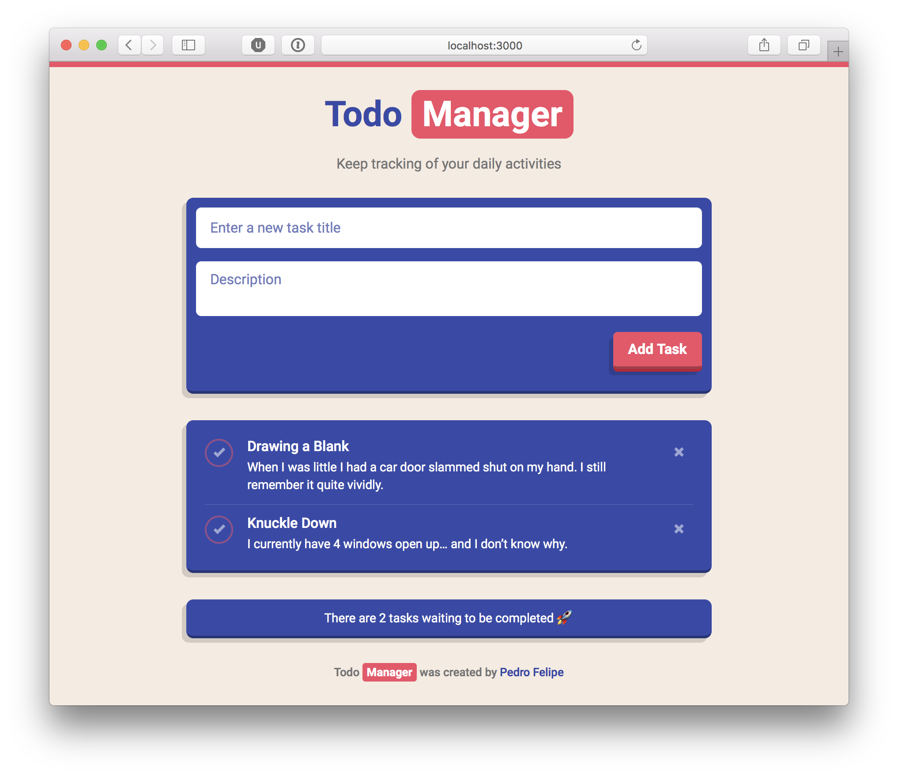

# React Todo Manager [](https://travis-ci.org/PedroFelipe/frontend-tech-test)



A todo tasks manager written with React and a gorgeous UI.

## [Demo](https://nl-react-todo-manager.herokuapp.com)

## Running
### `npm start`

Runs the app in the development mode.<br>
Open [http://localhost:3000](http://localhost:3000) to view it in the browser.

### `npm test:app`

Runs tests for backend server.

### `npm run build`

Builds the app for production to the `build` folder.

## Folder Structure

```
react-todo-manager/
  README.md
  package.json
  app/
    app.js
    controller.js
    spec.js
    tasks.json
  public/
    index.html
    favicon.ico
    manifest.json
  src/
    actions/
    components/
    constants/
    containers/
    css/
    decorators/
    reducers/
    index.css
    index.js
```

## What’s Inside?

* [React](https://facebook.github.io/react)
* [Redux](http://redux.js.org)
* [Babel](http://babeljs.io)
* [webpack](https://webpack.js.org)
* [ESLint](http://eslint.org)
* [Chai](http://chaijs.com)
* [Jest](http://facebook.github.io/jest)
* [Mocha](https://mochajs.org)
* [Supertest](https://github.com/visionmedia/supertest)
* [Sass](http://sass-lang.com)
* [Autoprefixer](https://github.com/postcss/autoprefixer)
* [Bootstrap](http://getbootstrap.com)

## Requirements
- [x] React 16 and Redux
- [x] Sass
- [x] Responsiveness
- [x] Integration tests on backend with 100% coverage
- [x] UI inspired on [vliegwinkel.nl](https://www.vliegwinkel.nl)
